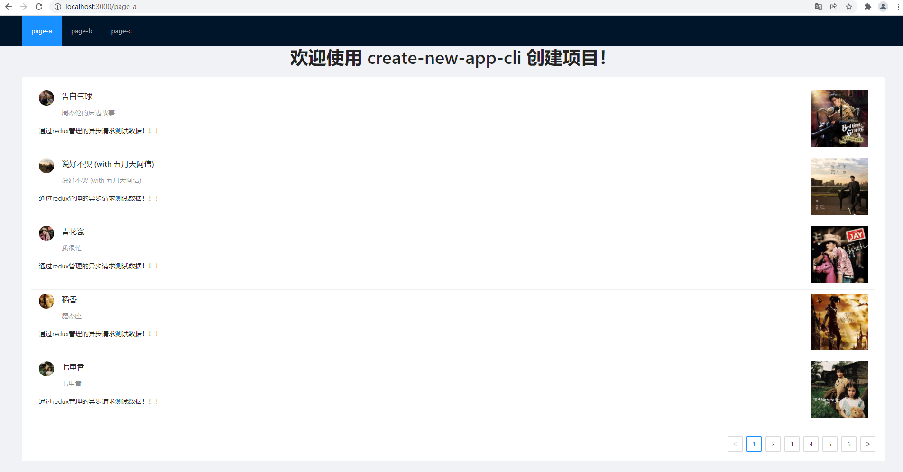
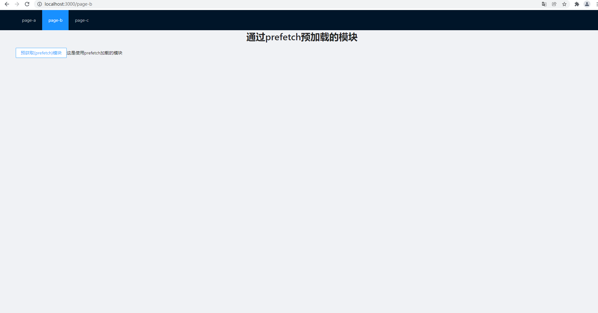
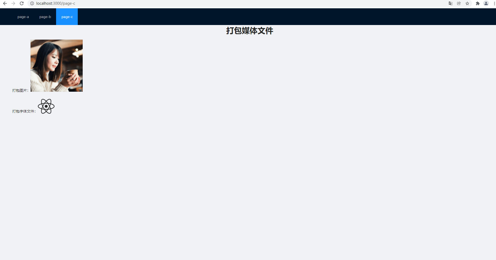

# create-new-app-cli
一个帮你快速搭建前端应用的脚手架工具

## 安装
```
npm install create-new-app-cli -g
```
安装完成后就可以在命令行使用 ```cnac``` 命令来创建项目了

## 创建项目
> 目前只支持 react + webpack 项目，后续会支持 react + vite，vue + webpack，vue + vite等
```
cnac create demo
```
+ 执行上面的命令后，会自动拉取项目模板，安装项目依赖，启动项目
+ 由于项目默认安装了一些常用的第三方模块，默认使用npm下载安装，安装可能会花费一些时间，请耐心等待
+ 安装完成后在浏览器输入```http://localhost:3000```查看项目
+ 注：git clone下载线上模板代码有时会失败，当git clone失败时会自动启用备选方案，从本地拷贝项目以完成项目创建

当前创建的项目已经默认配置了如下信息：
+ 作者从 0 到 1 使用 webpack 实现的项目打包配置信息
+ 使用 react-router 管理的三个页面
+ 使用 react-redux 管理数据
+ axios 异步请求（通过 redux-thunk 实现 redux 对异步请求的管理管理）
+ antd 组件库


**查看项目模板，请移步**[react-app-template](https://github.com/code2nd/react-app-template)


> demo 运行成功后的三个页面：
>
> page-a：通过react-redux，redux-thunk管理的请求的测试数据展示列表
>
> page-b：测试对于prefetch预获取的模块打包
>
> page-c：测试媒体文件的打包

 页面截图：

 

 

 
